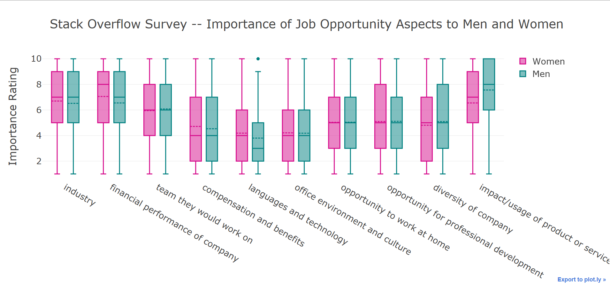

# StackOverflow Survey Analysis
Stack Overflow conducts yearly surveys from their users. The survey contains questions asking about the participants' salary, happiness in the workplace, competitiveness at the work place, their education, their thoughts about AI, and many more. The 2018 survey results were [published publicly on Kaggle](https://www.kaggle.com/stackoverflow/stack-overflow-2018-developer-survey) and I thought I would explore it a little for my first data analysis project.

I thought something that would be interesting to explore would be the differences in responses to questions between men and women. As many know, there is quite a gender gap in the tech world. Maybe there is something that this survey could tell us about that? Maybe it is not so obvious?

For now I've just taken a look at the responses to questions about the importance of certain aspects of a job opportunity. Participants were asked to rate on a scale of 1-10 the importance of things like benefits, industry, company culture, etc. My program looks at these responses, groups them by gender and topic, and creates a [boxplot with Plotly](https://plot.ly/~ambigraham/3/stack-overflow-survey-importance-of-job-opportunity-aspects-to-men-and-women/#/).



There is truly so much to explore with this data set and I hope to do more! 

I hope this project will at least be useful for other beginners with data analysis looking to see how you can make cool data visualizations with Python.

## Installation
When you download this project you will first need to extract the zip file. This zip contains the survey results as a csv as well as a schema for the questions asked in the survey as a csv. The schema is not neccessary for the project to run but it is extremely helpful for understanding the columns in the very large data set. The path from the project folder to the csv should be:
```
/stack-overflow-2018-developer-survey/survey_results_public.csv
```

You will also of course need [Python](https://www.python.org/downloads/) installed on your machine as well as a few modules. I used Python version 3.6.5.
The modules you need to install are:
* pandas
* plotly
* cufflinks

To easily do this, you can use pip on your command line. For example:
```
py pip install pandas
```

## Plotly Set Up
In this project I used plotly to create my graphs. Plotly caught my attention out of some of the other graphic modules because it offered free web hosting on their site as well as the ability to create offline graphs. I also thought they were pretty aesthetically pleasing and offered a lot of interactivity!

If you want to utilize plotly's online web hosting, you will have to follow the [initialization instructions](https://plot.ly/python/getting-started/#initialization-for-online-plotting) Plotly provided and uncomment this line in my project:
```
#py.iplot(fig, filename = 'stackoverflow-chart1')
```
Note that running this line could take some time -- in my experience it could be a minute or so.

If you just want an offline graph, you should be good to go and the program will create a local html file for you upon running. Offline graphs are also much quicker to run!

## Deployment
Just run this line on your command line while in the project directory:
```
py analysis.py
```

## Built With
* [Plotly](https://plot.ly/python/)

## Author
[Amber Graham](github.com/ambergraham)
